# Multi-task Learning for Optical Coherence Tomography Angiography (OCTA) Vessel Segmentation

Multi-task learning trains a single model to handle multiple related tasks together, leveraging shared knowledge to improve performance across all tasks. By jointly optimizing on multiple tasks, the model can learn common patterns and representations, leading to enhanced efficiency and understanding of the data. 

In this repository we used the loss combination method that is introduced in [Multi-Task Learning Using Uncertainty to Weigh Losses for Scene Geometry and Semantics](https://arxiv.org/abs/1705.07115)

In this repository, we aimed to show that combining losses using multitask learning provides better results in Optical Coherence Tomography Angiography (OCTA) vessel segmentation than single U-Net Architecture. 
 
## Single Task Learning
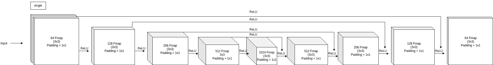

The U-Net architecture consists of two main parts: an encoder and a decoder. The encoder is responsible for extracting features from the input image, while the decoder is responsible for upsampling these features and generating the output segmentation map. The encoder is typically made up of a series of convolutional layers, followed by max pooling layers. The decoder is typically made up of a series of upsampling layers, followed by convolutional layers.


<code> </code>


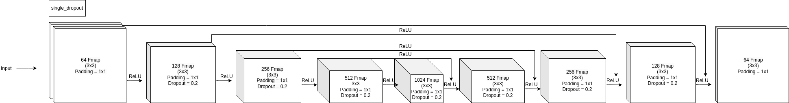

In a single U-Net architecture, dropout can be used to prevent overfitting in the encoder and decoder parts of the network. In the encoder, dropout can help to prevent the network from learning to rely on specific features in the input image. In the decoder, dropout can help to prevent the network from learning to generate specific output segmentation maps.

Dropout can be used with any neural network architecture, but it is especially important for single U-Nets, which can be prone to overfitting. Dropout can help to improve the performance of single U-Nets on a variety of tasks, including OCTA vessel segmentation.

## Muti-task Learning
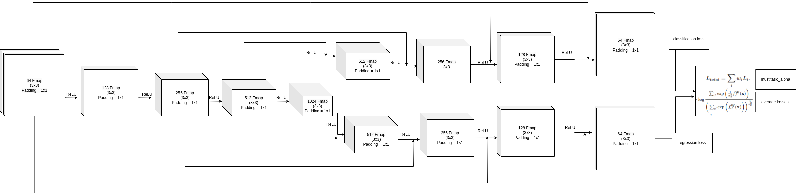

Above is the plot of the Multi-task model. In this model we combine mean squared error (regression) along with binary cross entropy (classification). The model takes in the input below and it tries to predict the segmentation map along with the distance map. 

The classification model takes in the following image:

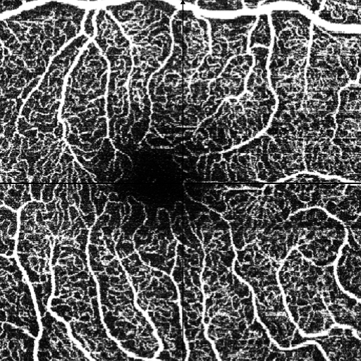

The model tries to predict the distance map below:


The model also tries to predict the segmentation map below:

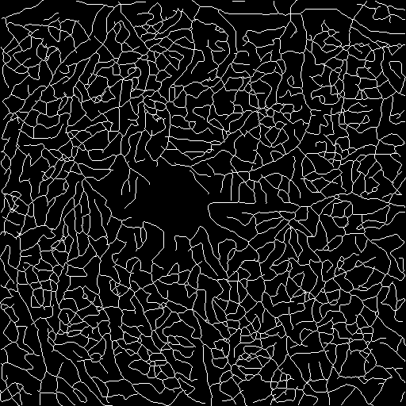

After making a request for the ROSE dataset from OCTANet’s authors we applied Distance transform on the original images to obtain the image above. [binary2dist.py](https://github.com/canxkoz/DRAC2022/blob/main/archive/Distance-Transformation/binary2dist.py) can be used to obtain the distance maps.

```
python binary2dist.py
```

The AlphaLoss class takes two lists of losses as input, one for the segmentation tasks and one for the regression tasks. It then combines these losses using a weighted sum by using  the variable alpha, it is a weighting factor that balances the contribution of the two loss functions in the total loss that is used for training the model. The total loss is calculated as loss = loss1 + alpha*loss2, where loss1 is the BCE loss and loss2 is the MSE loss.

In the first epoch <code>(epoch == 1)</code>, alpha is set to 0, so only the BCE loss contributes to the total loss. This means that in the first epoch, the model is trained only on the segmentation task.

In subsequent epochs, alpha is calculated as the ratio of the average BCE loss to the average MSE loss from the previous epoch using the folowing equation: <code>(alpha = (sum(self.bce_loss) / len(self.bce_loss))/(sum(self.mse_loss) / len(self.mse_loss)))</code>. This means that if the BCE loss is larger, alpha will be larger, and the MSE loss will contribute more to the total loss. 

Conversely, if the MSE loss is larger, alpha will be smaller, and the BCE loss will contribute more to the total loss. This dynamic adjustment of alpha allows the model to balance its performance on the segmentation and regression tasks. If the model is performing poorly on the segmentation task, it will focus more on that task in the next epoch, and vice versa.


The Multitask Uncertainty Loss class takes two lists of losses as input, one for the segmentation tasks and one for the regression tasks. It then combines these losses using a weighted sum, where the weights are determined by the uncertainty of the predictions.

The uncertainty of the predictions is calculated using the log variance of the predicted distribution. The log variance is a measure of how spread out the predictions are, and it is used to weight the losses so that the model is more confident in its predictions for the tasks with lower uncertainty. Final loss is then calculated by combining the two losses using a weighted sum. The weights are determined by the uncertainty of the predictions, so the loss for the task with lower uncertainty will have a lower weight. 

Multitask Uncertainty Loss class can be used to improve the performance of a model on tasks with high uncertainty. This is because the model is less likely to overfit to the training data for tasks with high uncertainty, and it is more likely to generalize well to new data.


Above is the equation of the Multitask Uncertainty Loss.
Comparing loss weightings when learning classification and regression similarly to the [paper](https://arxiv.org/pdf/1705.07115.pdf).

On the line chart below; std_1 is classification loss (BCE) and std_2 is regression loss (MSE). The chart shows the balance between the tasks. 

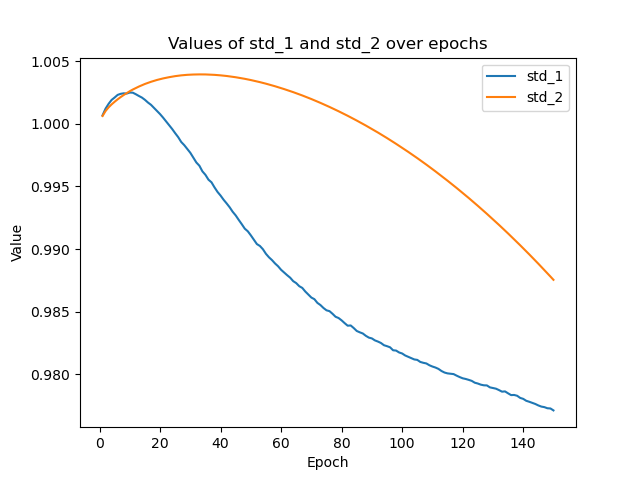

Balancing Task Importance: The uncertainty term in the loss function allows tasks with higher uncertainties to have a smaller impact on the overall loss. This helps balance the importance of different tasks during training. Tasks with low uncertainties contribute more to the loss, while tasks with high uncertainties have a reduced impact, preventing them from dominating the training process.

### BCE Loss:

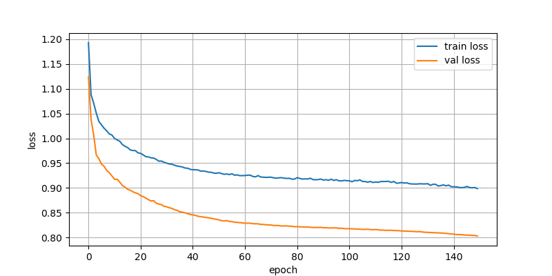

### MSE Loss:

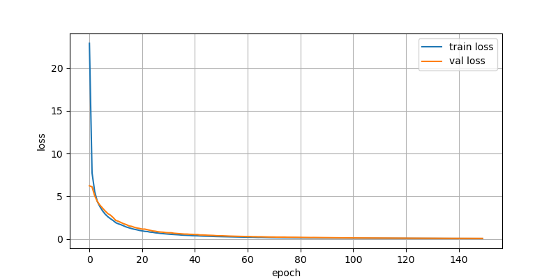

## Visual Results:

Multi-task (Multi-task 64F 8W)

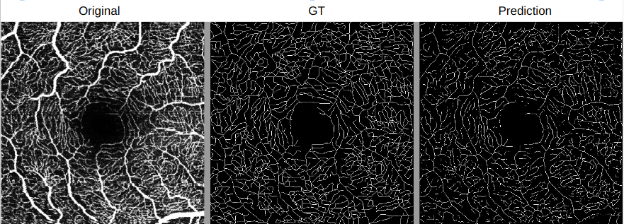


Single Task (Single Task 64F 8W)

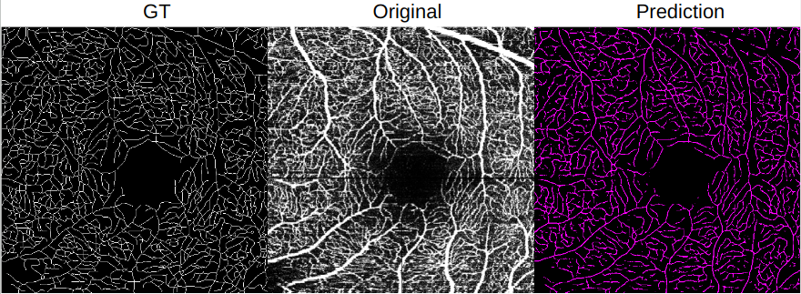


Results on a completely different dataset that has different resolution. (DRAC2022 Dataset Single Task 32F)

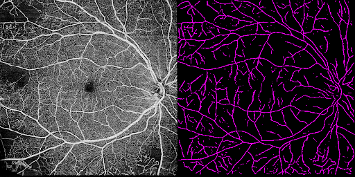


## Results:

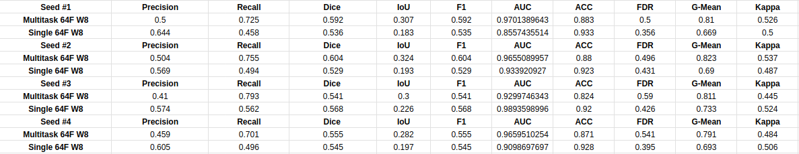

Although we were unable to replicate scores on ROSE-2 dataset using the [OCTANet](https://github.com/iMED-Lab/OCTA-Net-OCTA-Vessel-Segmentation-Network) repository, Multi-task learning showed slight improvements in scores when compared to the single U-Net architecture.

Feel free to add new loss functions and experiment with different parameters!

Explanation of abbreviation on the config file:

<code>ce:</code> cross entropy loss 

<code>bce:</code> binary cross entropy loss 

<code>mse:</code> mean squared error

<code>rmse:</code> root mean squared error

<code>Dice:</code> calculates dice loss

<code>Dice_bce:</code> sums classification losses

<code>Radam:</code> rectified adam optimizer 


### Install all requirements:
```
pip install -r requirements.txt
```

### Run train and test:
```
python3 train.py
python3 test.py
```


